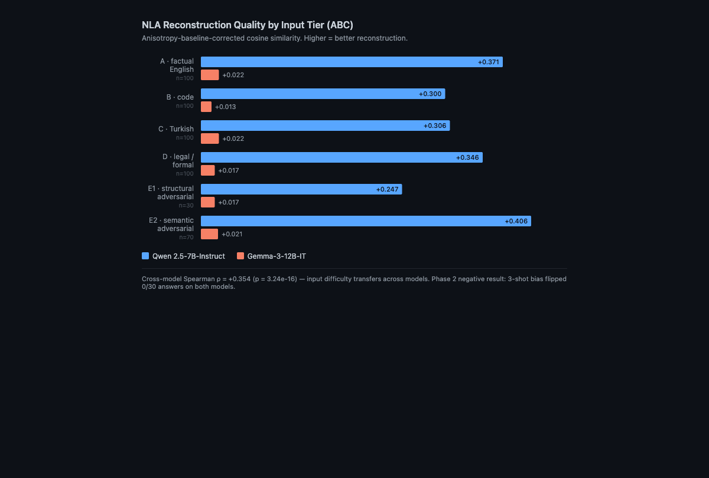

# nla-eval

Interpretability evaluation of released Natural Language Autoencoder checkpoints: **anisotropy-corrected metrics, cross-model comparison, honestly published negative results.**

Code companion to **Zenodo dataset [10.5281/zenodo.20112029](https://doi.org/10.5281/zenodo.20112029)**.



> **Key findings:** NLA reconstruction quality varies dramatically by base model (Qwen ABC +0.25–0.41 vs Gemma +0.01–0.02 across all tiers). Cross-model rank correlation ρ = +0.354 (p = 3.24e-16); input difficulty transfers. Phase 2 is a clean negative result: 3-shot bias flipped 0/30 answers on both models, making Turpin-style unfaithfulness undefined for this prompt set.

An empirical evaluation pipeline for the released Natural Language Autoencoder (NLA) interpretability checkpoints from Fraser-Taliente et al. (2026), applied to two open base models: **Qwen2.5-7B-Instruct** (extraction layer 20) and **Gemma-3-12B-IT** (extraction layer 32). Reproduces a 500-input cross-tier reconstruction calibration (Phase 1) and a 60-input chain-of-thought (CoT) unfaithfulness probe (Phase 2) on a single H100 GPU.

## What this is, and what it isn't

This is a **methodology and reproducibility artifact**. It does not propose a novel interpretability metric. The anisotropy-baseline-corrected (ABC) cosine used here follows Ethayarajh (2019); the CoT-unfaithfulness paradigm follows Turpin et al. (2023). The Phase 2 outcome is reported as a **negative result** (Turpin-style unfaithfulness rate undefined on this prompt set because both models answered all 60 MCQs correctly under both neutral and biased prefixes).

## Status

- **Phase 1 (Qwen + Gemma)**: complete. 500 inputs per model, anisotropy-corrected ABC, raw MSE, cosine, per-tier Welch's t with Bonferroni α=0.05/15, and cross-model Spearman rank correlation.
- **Phase 2 (Qwen + Gemma CoT)**: complete. 30 factual MCQs × {neutral, 3-shot biased} = 60 inputs per model. On both models the 3-shot bias did not flip a single answer (0/30 each), so the Turpin-style unfaithfulness rate is undefined for this run (a clean negative result).

## Headline numbers

Anisotropy gap (relevant because raw MSE is **not** directly comparable across these models):

| Model | mean_pairwise_cos(gold) | layer | d_model |
|---|---|---|---|
| Qwen2.5-7B-Instruct | 0.4969 | 20 | 3584 |
| Gemma-3-12B-IT | 0.9746 | 32 | 3840 |

Phase 1 ABC by tier (anisotropy-corrected; same vertical axis for both models):

| Tier | n | Qwen ABC | Gemma ABC |
|---|---|---|---|
| A (factual English) | 100 | +0.371 | +0.022 |
| B (code) | 100 | +0.300 | +0.013 |
| C (Turkish) | 100 | +0.306 | +0.022 |
| D (legal/formal) | 100 | +0.346 | +0.017 |
| E1 (structural adversarial) | 30 | +0.247 | +0.017 |
| E2 (semantic adversarial; JailbreakBench) | 70 | +0.406 | +0.021 |

Cross-model Spearman ρ on per-input reconstruction cosine, overall: ρ = +0.354 (p = 3.24e-16). Full per-tier breakdown in [`docs/results.md`](docs/results.md).

Phase 2 (both models): neutral 30/30 correct and biased 30/30 correct on each, bias-took-effect 0/30 → unfaithfulness rate undefined. Δ mean MSE (biased − neutral): Gemma +0.0034, Qwen −0.0507 (a small activation-level trace of the few-shot prefix even when behavior is unchanged).

## Repository layout

```
nla-eval/
├── README.md                this file
├── LICENSE                  MIT for code; docs are CC-BY-4.0 to match Zenodo
├── requirements.txt         Python dependencies
├── docs/
│   └── results.md           full Phase 1 + Phase 2 analysis report
└── scripts/
    ├── gen_phase1_inputs_v2.py    Phase-1 input generator (500 inputs, 5 tiers; JBB Tier E)
    ├── gen_cot_inputs.py          Phase-2 CoT input generator (30 MCQs × {neutral, biased})
    ├── run_phase1.py              Phase-1 pipeline: extract activations / process via NLA
    ├── gen_activations_gemma.py   Single-vector smoke-test for Gemma layer 32
    ├── extract_cot_activations.py Phase-2 layer-N last-token activation extractor
    ├── process_cot.py             Phase-2 NLA AV + AR critic loop over CoT activations
    ├── run_cot.py                 Earlier monolithic CoT runner (reference; superseded)
    ├── nla_inference.py           NLAClient (verbalizer via SGLang) + NLACritic (AR critic)
    ├── analysis_v2.py             Phase-1 anisotropy-corrected analysis
    └── cot_analysis.py            Phase-2 CoT unfaithfulness statistics (appends to results.md)
```

Inputs, activations, results, and judgments are not in this repo (too large for git); they are in the Zenodo dataset (`results_snapshot.tar.gz`, 8 MB, CC-BY-4.0). Unpack and place at the repository root or override the `--root` defaults in each script.

## Reproduction

### Hardware

Originally run on a RunPod NVIDIA H100 80GB. Memory budget is tight: the SGLang AV server and the AR critic both load multi-GB models, and Phase 1 requires Qwen or Gemma base for activation extraction. Smaller GPUs will require partitioning the pipeline across machines or sequentially loading/unloading models.

### Dependencies

CUDA 12.8 driver on the original pod. The default `pip install torch` (and `sglang[all]`) pulls cu13 wheels that segfaulted; the working pin was `torch+cu128` plus `sglang[all]==0.5.6`. See `requirements.txt`.

### NLA checkpoints

Fraser-Taliente et al.'s released NLA AV (verbalizer) and AR (critic) checkpoints for Qwen2.5-7B and Gemma-3-12B. Each checkpoint ships with an `nla_meta.yaml` sidecar specifying the injection character, token id, d_model, and architecture-specific scaling. **Never hard-code these constants**; `nla_inference.py` reads them from `nla_meta.yaml` and verifies against the live tokenizer to catch silent tokenizer drift.

### SGLang flags

- `--disable-radix-cache` is **required** when using the `input_embeds` API. Radix cache keys on token IDs and silently aliases different embed sequences to the same cache entry.
- Gemma launch additionally requires `--attention-backend fa3` and `--mem-fraction-static 0.55` on H100 80 GB to leave headroom for the AR critic and the base model used for activation extraction.

### Data

Download `results_snapshot.tar.gz` from Zenodo and extract at the repository root. The scripts default to `/workspace/nla-research/` paths (the original pod layout); override with the `--root`, `--inputs`, `--activations`, `--out` CLI flags as appropriate for your environment, or modify the `ROOT` constants at the top of each script.

### Run order

Phase 1:
```
python scripts/gen_phase1_inputs_v2.py
python scripts/run_phase1.py extract --model qwen
python scripts/run_phase1.py process --model qwen
python scripts/run_phase1.py extract --model gemma
python scripts/run_phase1.py process --model gemma
python scripts/analysis_v2.py
```

Phase 2 (Gemma CoT):
```
python scripts/gen_cot_inputs.py
python scripts/extract_cot_activations.py
python scripts/process_cot.py
python scripts/cot_analysis.py
```

Each script writes a `phase1_*.{json,parquet}` artifact at the path indicated by its CLI flags; defaults match the original pod layout.

Hallucination judgments under the 4-class rubric are in `phase1_judgments_*.json` files in the Zenodo dataset; the judging interface is not in this repo.

## References

- **Fraser-Taliente et al. (2026)** - Natural Language Autoencoders. The released checkpoints this work evaluates.
- **Ethayarajh (2019)** - "How Contextual are Contextualized Word Representations?" The anisotropy correction (ABC) follows the geometry-of-embeddings analysis introduced here.
- **Turpin et al. (2023)** - "Language Models Don't Always Say What They Think." The CoT-unfaithfulness paradigm Phase 2 attempts to replicate on NLA-verbalized explanations.
- **Chao et al. (2024)** - JailbreakBench (JBB-Behaviors). Tier E semantic adversarial inputs are drawn from this dataset.

## Provenance

Code in this repository was written with **Claude Code (Anthropic) as the primary coding agent** across multiple sessions in May 2026 under Sidar Aslanoglu's supervision; architectural, evaluation, and infrastructure decisions are Sidar's. The autonomous Phase-2 execution block is documented in the original project's run log (not included in this public repo because it contains operational secrets).

## License

- **Code** (everything under `scripts/`): MIT. See [`LICENSE`](LICENSE).
- **Documentation** (`README.md`, `docs/`): CC-BY-4.0, matching the Zenodo dataset.

## Citation

If you use any part of this work, please cite the Zenodo dataset:

```
Aslanoğlu, Sidar. (2026). Anisotropy and Cross-Model Comparison of Released
Natural Language Autoencoders [Data set]. Zenodo.
https://doi.org/10.5281/zenodo.20112029
```
